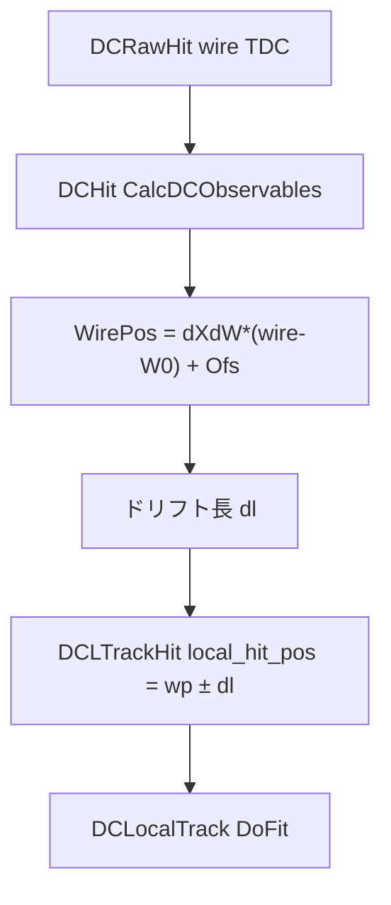

# DCGEO 幾何パラメータと Tracking における Ofs / TA / RA

E72 BLC（BcIn / BcOut）トラッキングで使われる `DCGeomParam` の各列が、コード上でどう解釈され、
ヒット位置・フィット・D5 にどう効くかを整理したメモです。

対象コード（本リポジトリ）:

| 役割 | 主なファイル |
|------|----------------|
| パラメータ読込 | [`src/DCGeomMan.cc`](../../../src/DCGeomMan.cc) |
| 1 層の幾何定義 | [`src/DCGeomRecord.cc`](../../../src/DCGeomRecord.cc), [`include/DCGeomRecord.hh`](../../../include/DCGeomRecord.hh) |
| ワイヤー位置・ドリフト | [`src/DCHit.cc`](../../../src/DCHit.cc) |
| トラックヒット・残差 | [`src/DCLTrackHit.cc`](../../../src/DCLTrackHit.cc) |
| BLC 直線フィット | [`src/DCLocalTrack.cc`](../../../src/DCLocalTrack.cc) |
| D5 運動量フィット | [`src/D5Track.cc`](../../../src/D5Track.cc) |
| 測量 → Ofs 反映ヘルパー | [`scripts/apply_dcgeo_offset.py`](../scripts/apply_dcgeo_offset.py) |
| residual → Ofs 更新 | [`scripts/update_param.py`](../scripts/update_param.py)（`residual`） |

パラメータファイル例: [`param/DCGEO/DCGeomParam_e72_example`](../../../param/DCGEO/DCGeomParam_e72_example)

---

## 1. DCGeomParam の 1 行が表すもの

1 行 = **1 ワイヤー層（plane）** の幾何。BLC では `BLC1a-U1` のように「検出器名 + 層サフィックス」。

```
Id  Name  X  Y  Z  TA  RA1  RA2  L  Res  W0  dXdW  Ofs
```

| 列 | メンバ | 意味（コード上） |
|----|--------|------------------|
| Id | `m_id` | 層 ID。`DCGeomMan` のキー |
| Name | `m_name` | 層名 |
| X, Y, Z | `m_pos` | 層原点の **グローバル（FF）座標** [mm] |
| TA | `m_tilt_angle` | Tilt angle [deg] |
| RA1 | `m_rot_angle1` | X 軸回り回転 [deg] |
| RA2 | `m_rot_angle2` | Y 軸回り回転 [deg]（E72 は **kS2s** 定義） |
| L | `m_length` | ビーム方向の局所座標 **z** として使う長さ [mm] |
| Res | `m_resolution` | フィット用 σ [mm] |
| W0 | `m_w0` | 中心ワイヤー番号（0-origin） |
| dXdW | `m_dd` | ワイヤーピッチ [mm/wire] |
| Ofs | `m_offset` | ワイヤー **s 座標** の零点オフセット [mm] |

読込は `DCGeomMan::Initialize()` がストリームで 13 列を読み `DCGeomRecord` を生成します。

```273:277:src/DCGeomMan.cc
    if(iss >> id >> name >> gx >> gy >> gz >> ta >> ra1 >> ra2
       >> l >> res >> w0 >> dd >> ofs){
      DCGeomRecord *record =
	new DCGeomRecord(id, name, gx, gy, gz, ta, ra1, ra2,
                          l, res, w0, dd, ofs);
```

**BLC1 の典型値**: `X=Y=0`, `Z` と `L` はビーム軸上の位置（符号付き）。`TA` は U 層・V 層で符号が違う（nominal はおおよそ ±45° だが、測量後は 44° など **層ごとの実値** が入る）。

---

## 2. 座標系の定義（kS2s）

`DCGeomRecord::CalcVectors()` は E72 で **`kS2s`** 固定です（`GlobalCoordinate = kS2s`）。

```13:14:src/DCGeomRecord.cc
enum  EDefinition { kSks, kS2s };
const EDefinition GlobalCoordinate = kS2s;
```

各層に **直交な局所座標 (s, t, u)** を定義します。

| 軸 | 物理的意味（BLC） |
|----|-------------------|
| **s** | センスワイヤー方向（ドリフト測定のスカラー座標） |
| **t** | ワイヤー面内・ワイヤーに垂直 |
| **u** | ワイヤー面の法線方向 |

TA, RA1, RA2 から回転行列を組み立て、グローバル ↔ 局所の変換係数をキャッシュします（`m_dsdx` … `m_dudz`）。

**RA=0 のとき（BLC の通常設定）** は式が単純化し、

- `dsdx = cos(TA)`, `dsdy = sin(TA)`, `dsdz = 0`
- グローバル並進 `(dx, dy)` の s 方向成分は `cos(TA)*dx + sin(TA)*dy`

TA が 44° ならそのまま `cos(44°)`, `sin(44°)` が使われます。±45° 専用の特別扱いはありません。

### グローバル ↔ 局所の変換

点の変換（`DCGeomMan`）:

```346:357:src/DCGeomMan.cc
  Double_t x
    = record->dsdx()*(in.x()-record->Pos().x())
    + record->dsdy()*(in.y()-record->Pos().y())
    + record->dsdz()*(in.z()-record->Pos().z());
  // ... t, u も同様
```

- **Global2LocalPos**: グローバル座標 → その層の `(s, t, u)`
- **Local2GlobalPos**: 局所 `(s, t, u)` + 層原点 → グローバル

D5 のワイヤー χ² では、予測点を `Global2LocalPos` した **局所 x 成分（= s）** と測定 s を比較します（後述 §6）。

---

## 3. Ofs（offset）の定義

### 3.1 コード上の式

```145:148:src/DCGeomRecord.cc
DCGeomRecord::WirePos(Double_t wire) const
{
  return m_dd*(wire - m_w0)+m_offset;
}
```

- 入力: ワイヤー番号 `wire`（実数可）
- 出力: その層の **s 座標** [mm]
- `Ofs` は **線形に加算** されるだけ（他の列は変えない）

逆変換（s → ワイヤー番号）:

```154:155:src/DCGeomRecord.cc
  Double_t dw = ((pos-m_offset)/m_dd) + m_w0;
```

### 3.2 物理的な意味

Ofs は「**ワイヤー番号から決まる理想位置に対する、s 方向の平行移動**」です。

- チャンバー全体が剛体で動いても、コードは層ごとに TA/RA を持つ
- 測量の並進 `(dx, dy)` を Ofs に載せるときは、各層の s 軸方向への射影
  `ΔOfs = dsdx*dx + dsdy*dy + dsdz*dz`（[`apply_dcgeo_offset.py`](../scripts/apply_dcgeo_offset.py)）
- **層ごとに ΔOfs が違う**（同じチャンバーでも U/V で TA が違うため）

Ofs は **ワイヤーごとの z 位置は変えません**。Z/L/X/Y/RA を変えないのがこのヘルパーの前提です。

### 3.3 解析での調整の二段階

| 段階 | ツール | 内容 |
|------|--------|------|
| 初回（測量） | `apply_dcgeo_offset.py` | チャンバー中心の `(dx,dy)` を幾何的に Ofs へ |
| 微調（データ駆動） | `update_param.py residual` | 層ごと residual 平均を Ofs に加算（`start_col=12`） |

---

## 4. TA（Tilt Angle）

### 4.1 何に使うか

1. **ワイヤー s 軸の向き**（`CalcVectors` → `dsdx`, `dsdy`, `dsdz`）
2. **BLC 直線フィット**での x,y → s への投影

BLC トラックはビーム方向 z（= `L`）に沿った直線:

```
x(z) = x0 + u0 * z
y(z) = y0 + v0 * z
```

層 z でのトラックの **s 座標**:

```113:114:include/DCLocalTrack.hh
  Double_t GetS(Double_t z, Double_t tilt) const
  { return GetX(z)*TMath::Cos(tilt)+GetY(z)*TMath::Sin(tilt); }
```

フィット本体（`DCLocalTrack::DoFit`）でも同じ cos/sin 投影を使います:

```251:253:src/DCLocalTrack.cc
      Double_t scal = (x0+u0*z0[i])*ct[i]+(y0+v0*z0[i])*st[i];
      Double_t ss   = wp[i]+(s[i]-wp[i])/coss[i];
      Double_t res  = honeycomb[i] ? (ss-scal)*coss[i] : s[i]-scal;
```

ここで `ct[i]=cos(TA)`, `st[i]=sin(TA)` は **そのヒット層の TA**（`DCHit::GetTiltAngle()` → DCGEO から）。

### 4.2 注意: TA は層ごと・実測値

- U 層と V 層で TA が異なる（nominal では符号が逆）
- 測量で傾きが 45° ちょうどでない場合（44° 等）も、**その層の DCGEO 値がそのまま使われる**
- Uta180 診断のように **U 層だけ TA を書き換える**と、投影・D5 の Global2Local の両方に効く（x0/y0 ラベル問題の修正に相当）

### 4.3 RA≠0 のときの注意

BLC フィットの s 投影は **TA のみ**（cos/sin）を使い、RA1/RA2 は直接入りません。
一方 `Global2LocalPos` は **TA+RA 全体**を使います。

BLC では通常 `RA1=RA2=0` なので一致します。RA を入れる場合は、
フィット式と D5 の座標変換で扱いが揃っているか要確認です。

---

## 5. RA1 / RA2（Rotation Angle）

kS2s 定義では:

- **RA1**: X 軸回り
- **RA2**: Y 軸回り

`CalcVectors()` 内で TA → RA1 → RA2 の順に回転を合成し、
`(dsdx,…,dudz)` を計算します（[`src/DCGeomRecord.cc`](../../../src/DCGeomRecord.cc) 101–125 行付近）。

BLC 現行 DCGEO では **ほぼ 0**。傾き（チャンバーがわずかにねじれている等）は
手計算で RA に入れたうえで、測量並進を Ofs に投影する、という運用が想定されています。

**RA=0 のとき** `dsdz=0` なので、グローバル **dz は Ofs に効きません**（z ずれは L/Z や D5 側で扱う）。

---

## 6. L と Z の使い分け

| 量 | コードでの使われ方 |
|----|-------------------|
| **L** (`m_length`) | `DCGeomMan::GetLocalZ(layer)` の戻り値。**トラッキングの z 変数** |
| **Z** (`m_pos.Z()`) | 層原点のグローバル z。`Global2LocalPos` の原点オフセットに使用 |

BLC1 では多くの層で `Z` と `L` の絶対値が同じビーム位置を表しますが、役割は別です。

```69:71:src/DCGeomMan.cc
DCGeomMan::GetLocalZ(Int_t lnum) const
{
  return GetRecord(lnum)->Length();
}
```

`DCHit::CalcDCObservables` でヒットに付与される z:

```180:182:src/DCHit.cc
  m_wpos  = gGeom.CalcWirePosition(m_layer, m_wire);
  m_angle = gGeom.GetTiltAngle(m_layer);
  m_z     = gGeom.GetLocalZ(m_layer);
```

---

## 7. ヒット生成から BLC フィットまでの流れ



### 7.1 ワイヤー位置 wp

```180:180:src/DCHit.cc
  m_wpos  = gGeom.CalcWirePosition(m_layer, m_wire);
```

→ `DCGeomRecord::WirePos(wire)` → **Ofs が直接効く**。

### 7.2 測定 s 座標（local_hit_pos）

トラック候補生成（`DCTrackSearch::MakePairPlaneHitCluster`）で、
ドリフトの向きあい仮説として `wp+dl` / `wp-dl` の 2 候補を作ります:

```338:339:src/DCTrackSearch.cc
        DCPairHitCluster *cluster1 = new DCPairHitCluster(new DCLTrackHit(hit1,wp1+dl,m1));
        DCPairHitCluster *cluster2 = new DCPairHitCluster(new DCLTrackHit(hit1,wp1-dl,m1));
```

`DCLTrackHit::m_local_hit_pos` がこの **s 方向の測定値** です。

### 7.3 残差（BLC フィット後）

```73:83:src/DCLTrackHit.cc
  Double_t scal = GetLocalCalPos();  // トラックから予測した s
  Double_t wp   = GetWirePosition();
  Double_t ss   = wp+(m_local_hit_pos-wp)/coss;
  return (ss-scal)*coss;
```

ざっくり言うと **「測った s − トラックが予測する s」**（ハニカム補正あり）。
`update_param.py residual` はこの種の residual 分布を見て Ofs を足します。

---

## 8. D5 トラッキングでの Ofs / TA / RA

D5 は BLC1/BLC2 トラックを束ね、運動量・δ をフィットします。
各 BLC ヒットについて **ワイヤー χ²** を足します:

```33:41:src/D5Track.cc
  WireResidualChi2(const DCLTrackHit* hit, Double_t x_pred, Double_t y_pred,
                   Double_t z_hit, const DCGeomMan& gGeom)
  {
    ThreeVector pos_local = gGeom.Global2LocalPos(
      hit->LayerId(), ThreeVector(x_pred, y_pred, z_hit));
    Double_t resi = hit->GetLocalHitPos() - pos_local.x();
    Double_t reso = hit->GetResolution();
    return (resi * resi) / (reso * reso);
  }
```

| 項 | 意味 |
|----|------|
| `GetLocalHitPos()` | 測定 s（ワイヤー + ドリフト。Ofs 込み） |
| `x_pred, y_pred, z_hit` | BLC 直線トラックがその層 z で与える **グローバル的な x,y**（`x0+u0*z` 等） |
| `pos_local.x()` | そのグローバル点を **層の局所 s** に投影した値（TA+RA 込み） |

したがって D5 では:

- **Ofs** → 測定側 `GetLocalHitPos()` を動かす
- **TA / RA** → 予測側 `Global2LocalPos` の s 成分を動かす
- **x0, y0, u0, v0**（BLC フィット結果）→ 予測 x,y

チャンバー位置が「D5 で効く」というのは、BLC トラックの x0/y0 と
各ヒットの Ofs の両方が D5 χ² に入る、という二重の経路です。

---

## 9. パラメータを触ったときの効き方（まとめ）

| 変更 | WirePos / 測定 s | BLC 直線フィット | D5 予測 s | 備考 |
|------|------------------|------------------|-----------|------|
| **Ofs** | 直接 | 残差・χ² | 間接（測定側） | 層ごとに調整可能 |
| **TA** | しない | s 投影の向き | Global2Local | 層ごとに異なりうる |
| **RA1/2** | しない | フィット式には未使用 | Global2Local | BLC は通常 0 |
| **L** | z 変数 | フィットの独立変数 z | z_hit | Ofs ヘルパーでは非更新 |
| **X,Y,Z** | 原点オフセット | 間接 | Global2Local の原点 | 剛体並進は Ofs 投影で代用可 |
| **W0, dXdW** | ワイヤー番号↔s | 間接 | 間接 | ハードウェア定数 |

---

## 10. よくある混乱ポイント

### Q1. Ofs を増やすと残差はどう動く？

測定 s が増える（または減る）方向です。符号は `scale=±1` の確認や
`--scale -1` で [`apply_dcgeo_offset.py`](../scripts/apply_dcgeo_offset.py) から試します。

### Q2. チャンバー中心を (dx,dy) 動かしたいが、どの列？

初回は **各層 Ofs に射影して加算**（ヘルパー）。
X/Y/Z を直接いじるのではなく、層ごとの s 軸（TA/RA から計算）に沿った分だけ Ofs が変わります。

### Q3. U 層だけ x/y が入れ替わって見える問題

トラッキング出力の x0/y0 は FF 座標。U 層の **TA 定義**が FF とずれていると、
相関プロットで対角から外れます。Uta180（U 層 TA を +135° にする）で直った事例は、
**Ofs ではなく TA ラベル側**の問題でした。Ofs ヘルパーは TA を書き換えません。

### Q4. nominal ±45° 以外の TA

問題ありません。コードは常に **その層の DCGEO に書かれた TA** を `cos`/`sin`（および `CalcVectors`）に入れます。

---

## 11. 関連コマンド

```bash
# 内部整合性チェック（calc_s_axis）
python myanalysis/calibration/scripts/apply_dcgeo_offset.py --self-test

# 測量並進のドライラン
python myanalysis/calibration/scripts/apply_dcgeo_offset.py \
  param/DCGEO/e72/DCGeomParam_run03772_Pi \
  --offset BLC1a:0.5,-0.3 --bcin

# residual 微調（別途 ROOT 出力が必要）
# python myanalysis/calibration/scripts/update_param.py <run> residual <suffix>
```

---

## 12. 変更履歴

- 2026-06: 初版（E72 BLC / kS2s / `apply_dcgeo_offset` 運用を反映）
